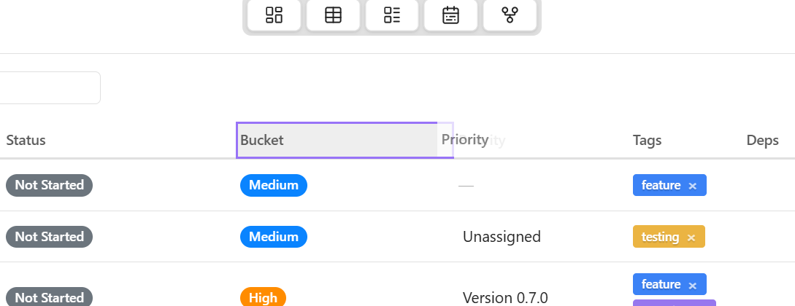
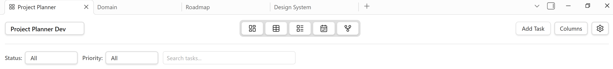

# [0.6.13] Development release 

The much needed rapid development week brought many improvements to the code base and fixed several bugs. During the last week, the plugin went from 0.6.9 to 0.6.13. Although there were no release announcements, all of the udpates have been documented in the [Changelog](https://projectplanner.md/changelog).  

Version **0.6.13** brings Project Planner to the end of the 0.6.* development phase and sets the stage for **0.7.0** with a stable foundation.  

This release adds column reording in Grid view, a new icon-based header, and fixes duplication bug in the Daily Note Scanner.

<!-- more -->

## Column reordering in Grid view

You can now drag a column to a new location, allowing you to configure the grid to suite your needs. Column order is of course configurable per-project, meaning each of your projects can use a different layout. The column order is also persistant so it will preserved across sessions. 

The screenshot doesn't really do it justice but here you go.

{ width="350" .center}

## The new icon-based header

The text-based plugin header has been updated with a cleaner look which replaces text with icons. I think this gives the header a more polished appearance and it also saves on screen realestate which helps a lot on smaller screens. 

{ width="350" .center}

## Fixed Daily Note scanner duplication

This is a hefty overhaul of the Daily Note Scanner system to prevent duplicate tasks with Obsidian Sync. If you're interested in reading more about the fixes, I invite you to read the [Changelog](https://projectplanner.md/changelog#fixed). 

Here's a quick overview:

- The plugin now stores and saves task locations
- Replaced random UUIDs with deterministic content hashing 
- Added duplicate detection
- Added file operation tracker which watches for renamed files, deleted files, and cleans up orphans
- Added enhanced metadata that includes source line number to help track task origin in daily notes

## How to install

Download the new version: [0.6.9](https://github.com/ArctykDev/obsidian-project-planner/releases/tag/0.6.9)

View the full list of changes: [Changelog](../../changelog.md)

View Blog: [Blog](../index.md)

