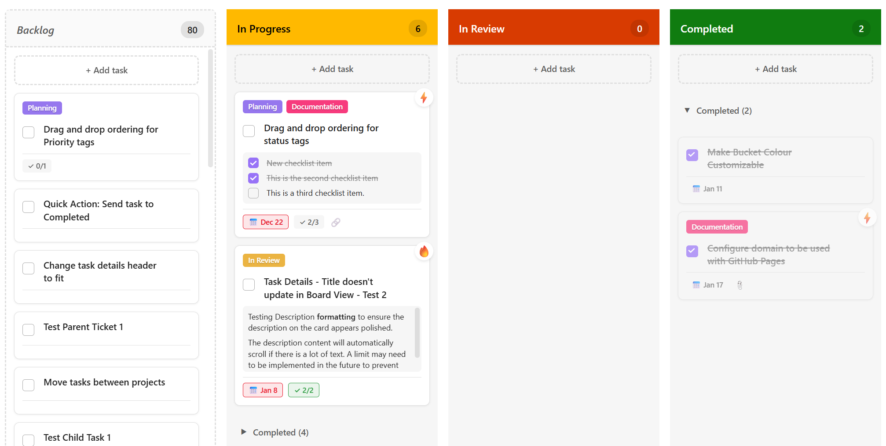

# [0.6.4] Development release

Version 0.6.4 is all about the Board view, featuring updated buckets and redesigned task cards. It also introduces a new feature that allows users to show or hide the task checklist and task description directly on the card. 

The option to choose what you want to display on the card has been added to the Task Details pane under **Card Preview**. Card Preview features the following options:

- Hide checklist and description
- Show checklist on the card
- Show description on the card

These options are card-specific, meaning you can choose a different option for each card. 

- The **Show checklist** option displays the checklist defined in Task Details and you can update checklist items directly on the card or from Task Details. The changes are displayed in real-time.

- The **Show description on card** option displays the task description defined in Task Details with Markdown applied. Changes to the description must be made in Task Details. The description will expand and scroll to fit on the card.

View the full list of changes: [Changelog](../../changelog.md)

View Blog: [Blog](../index.md)

## Screenshots

