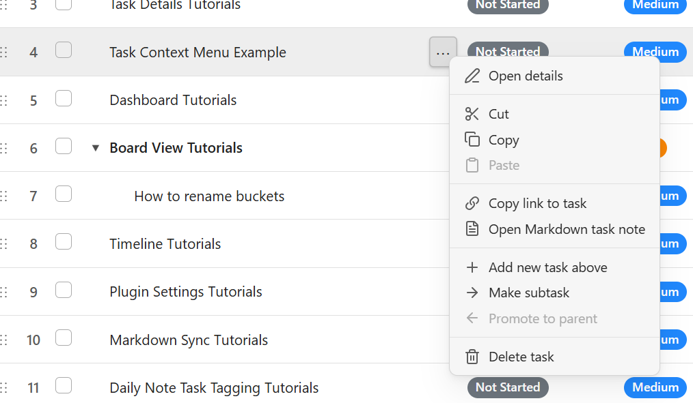
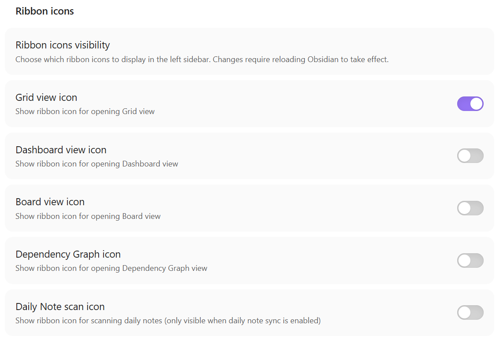

# [0.6.7] Development release 

More bug fixes improvements and a few tasy little treats. 

This is another small, patch release to the development version of Project Planner. This release features improved error handling, improved reliability, improved plugin code compliance with Obsidian and general code maintenance. 

If I was smart, that's where this release should have ended. However, I couldn't help myself and snuck in a few tasty treats into this one.

## The boring stuff highlights:

- Added memory leak prevention in Depencency Graph view
- Removed unsafe type assertions throughout the codebase
- Improved data persistance, specifically on Timeline view
- Improved error handling for vault related operations
- Fixed issue with Tasks list not aligning correctly with Gantt timeline

## The cool stuff highlights:

### Inline Editing for Buckets

You can now edit bucket names directly inline, and context menu buttons reveal themselves when you hover over buckets for quick access to actions.

### Enhanced Context Menu Functionality

The context menu now supports cut, copy, and paste operations for tasks, letting you quickly reorganize your projects. You can also generate deep links to specific tasks that work across all your devices, and opening markdown task notes will now auto-create the note if it doesn't exist—no more "note not found" errors.

### Ribbon Icon Customization

You can now customize which ribbon icons appear in your sidebar through the settings panel, choosing only the views you actually use to reduce clutter. Changes take effect after reloading Obsidian, so you can keep your workspace clean and focused.

<!-- more -->

## How to install

Download the new version: [0.6.7](https://github.com/ArctykDev/obsidian-project-planner/releases/tag/0.6.7)

View the full list of changes: [Changelog](../../changelog.md)

View Blog: [Blog](../index.md)

