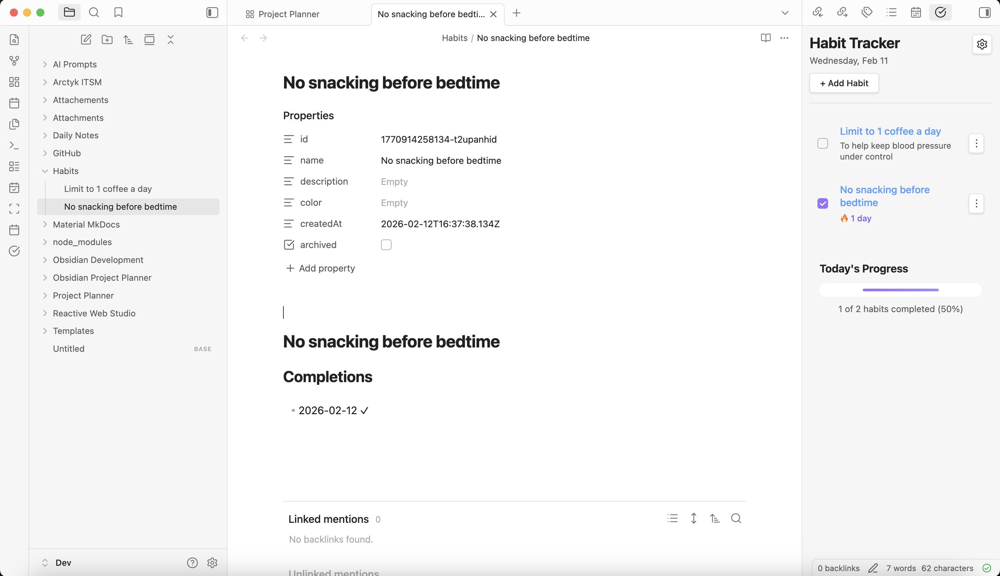
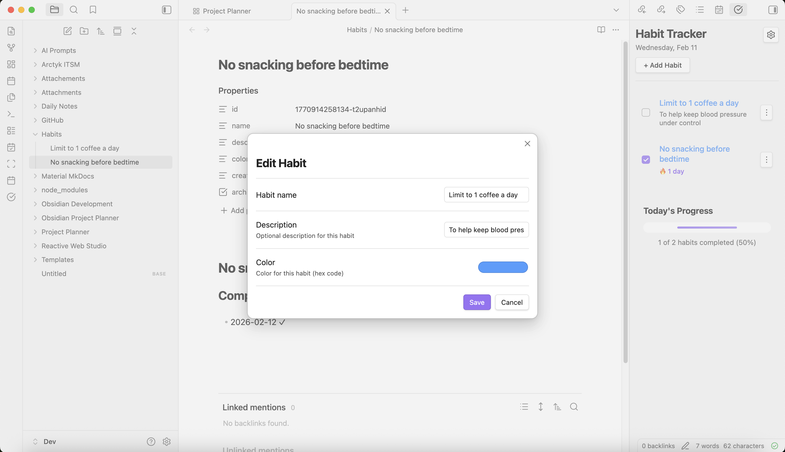
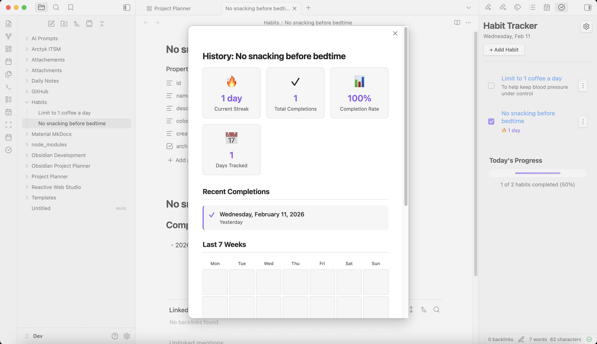
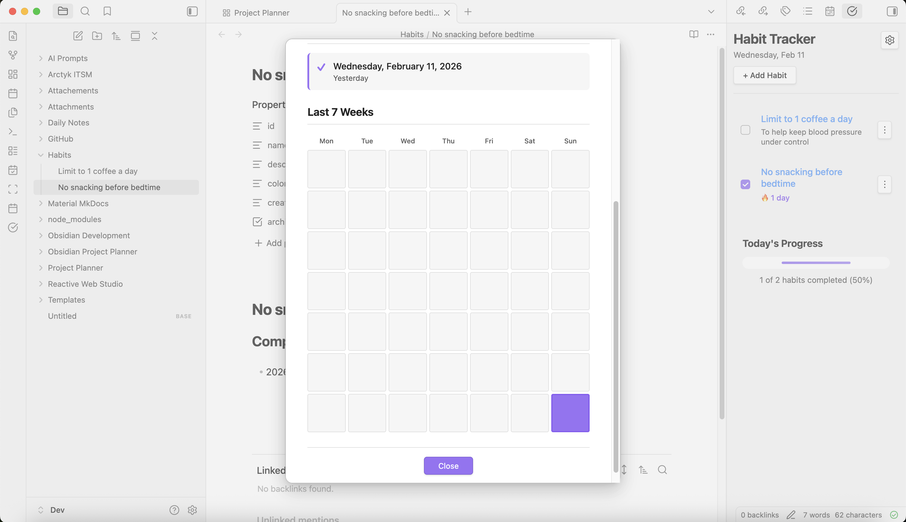
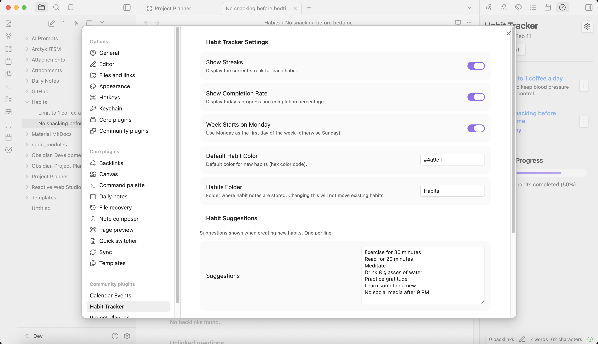

# Introducing Obsidian Habit Tracker

Recently, I've been listening to an audiobook called [Atomic Habits](https://atomichabits.com) by James Clear. It is full of interesting information about how habits form, how we can use basic strategies to grow good habits and break bad habits successfully. Throughout the book, James Clear introduces various tools that can help identify and manage habits, including a habit tracker, and a habit contract. The second he mentioned "habit tracker", my brain immediately went to "I could build that!" and "I could totally do this with Obsidian.". 

A habit tracker is a way to track all of your daily habits. The habits you track are completely up to you and can include both good or bad habits. A habit tracker can be as simple as crossing out days on a calendar, or using a jar of paperclips, transferring a paperclip from the "full" jar to the "empty" jar each time a habit is completed. For me, I knew I wanted to capture my habits using an app or service I'm already using, making it as convenient as possible. 

So I let the idea sit with me for a day or so and then I decided to go for it, and build a simple habit tracker plugin for Obsidian. I wanted something that was basic yet interactive enough to provide a sense of accomplishment when completing good habits and a little accountability when not following through on a habit. I also wanted it to feel as integrated with Obsidian as possible so that it just works and doesn't get in your way. 

All of this is a long way to say, I've built a habit tracker for Obsidian and I'm calling it... dun dun dun, Obsidian Habit Tracker. 

## Obsidian Habit Tracker v0.1.0

A powerful habit tracking plugin for Obsidian that helps you build and maintain daily habits with streaks, progress tracking, and an intuitive interface. **All your habit data is stored as markdown notes** in your vault for maximum transparency and portability.

**Editing a habit**

**View habit history**

**Habit Tracker settings**

---

# How to Install

## Install Habit Tracker manually

1. Download the latest release from the [Habit Tracker GitHub repository](https://github.com/ArctykDev/obsidian-habit-tracker/releases)

   - Download `main.js`, `manifest.json`, and `styles.css` from the latest release

2. Navigate to your Obsidian vault's plugins folder:

   - Open Obsidian and go to **Settings** → **General** → **About**
   - Click the folder icon next to "Vault location" to open your vault folder
   - Navigate to `.obsidian/plugins/` (create the `plugins` folder if it doesn't exist)

3. Create a new folder named `obsidian-habit-tracker` inside the plugins directory

4. Copy the downloaded files (`main.js`, `manifest.json`, and `styles.css`) into the `obsidian-habit-tracker` folder

5. Restart Obsidian or reload the app (Ctrl/Cmd + R)

6. Enable the plugin:
   - Go to **Settings** → **Community plugins**
   - Find "Habit Tracker" in the list
   - Toggle it on

## Install Habit Tracker using Obsidian BRAT community plugin

[BRAT (Beta Reviewers Auto-update Tester)](https://github.com/TfTHacker/obsidian42-brat) is a community plugin that allows you to install and test beta plugins directly from GitHub repositories.

1. Install the BRAT plugin (if not already installed):

   - Go to **Settings** → **Community plugins** → **Browse**
   - Search for "BRAT"
   - Click **Install**, then **Enable**

2. Add Habit Tracker to BRAT:

   - Go to **Settings** → **BRAT**
   - Click **Add Beta plugin**
   - Enter the repository URL: `ArctykDev/obsidian-habit-tracker`
   - Click **Add Plugin**

3. Enable Habit Tracker:
   - BRAT will automatically download and install the plugin
   - Go to **Settings** → **Community plugins**
   - Find "Habit Tracker" in the list
   - Toggle it on

!!! tip
    BRAT will automatically check for and install updates to Habit Tracker, keeping you on the latest version.

