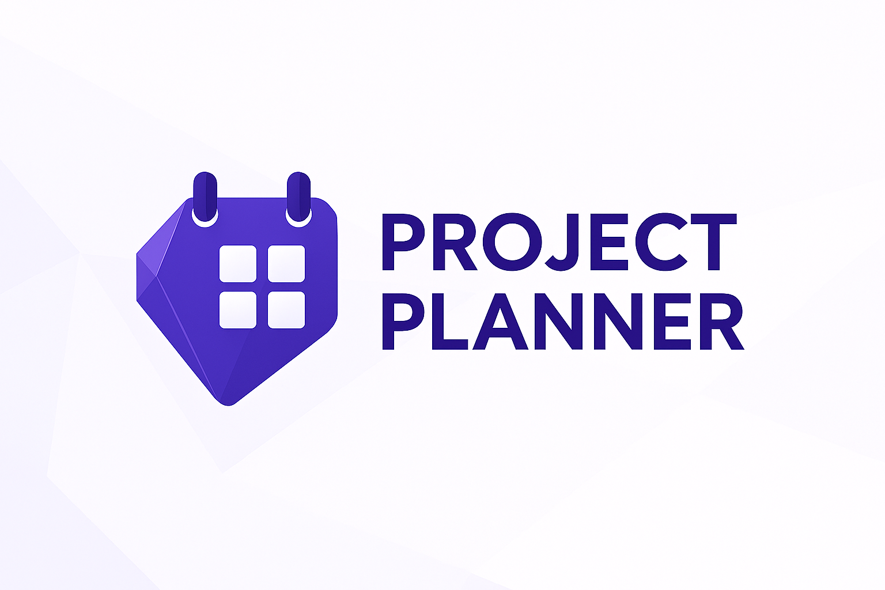

<h1 style="font-size: 2.6em; font-weight: 700;">ProjectPlanner.md</h1>

Plan smarter. Visualize better. Achieve more.

News & Updates

Get the latest news, updates, tips and tricks

- :rocket: **2026-02-01** - [Rapid Development](blog/posts/rapid-development.md)
- :material-arrow-right-circle-outline: **2026-01-31** - [0.6.9 Development Release](blog/posts/0-6-9-dev.md)
- :test_tube: **2026-01-30** - [Call for Testers!](blog/posts/call-for-testers-macos-linux.md)
- :material-arrow-right-circle-outline: **2026-01-29** - [0.6.7 Development Release](blog/posts/0-6-7-dev.md)

Built for Obsidian

Powerful project management tools integrated directly into your vault

- :fontawesome-brands-markdown: **Markdown-Native Task Storage**
 
All your tasks and projects live as markdown files in your vault, giving you complete ownership and portability of your data

- :material-note-plus: **Seamless Note Integration**
 
Link tasks directly to your notes, leverage Obsidian's powerful backlinks, and automatically generate task notes that sync bidirectionally.

- :material-safe-square-outline: **Vault-Centric Design**
 
Works entirely within your Obsidian vault with no external databases or cloud dependencies—your project data stays where it belongs.

- :octicons-tag-24: **Daily Notes Tagging**
 
Built-in support for Obsidian's Daily Notes workflow, allowing you to tag tasks and create time-based references automatically.

Check out the Views

Powerful project management tools integrated directly into your vault

- :material-view-dashboard: **Dashboard**
 
Get a comprehensive overview of all your projects and tasks with customizable widgets, metrics, and at-a-glance status tracking.

- :material-grid-large: **Grid**
 
Manage tasks in a powerful spreadsheet-like interface with sortable columns, filtering, and bulk editing capabilities.

- :fontawesome-solid-table-columns: **Board**
 
Visualize your workflow with a Kanban-style board view, drag-and-drop tasks between columns, and track progress visually.

- :fontawesome-solid-chart-gantt: **Timeline**
 
Plan and schedule projects with a Gantt chart timeline, visualize dependencies, and manage deadlines effectively.

Support the Project Planner

Dontations help serve the project and Obsidian community. 

Project Planner is free to use and enjoy but donations help support growth and improvements for the plugin. [Learn other ways you can contribute](community/contributing.md)

