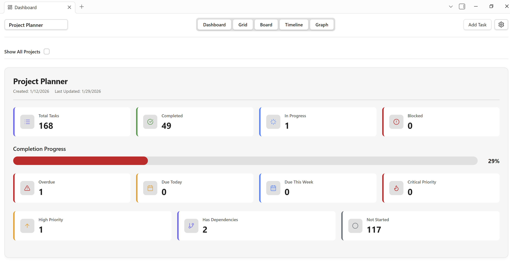
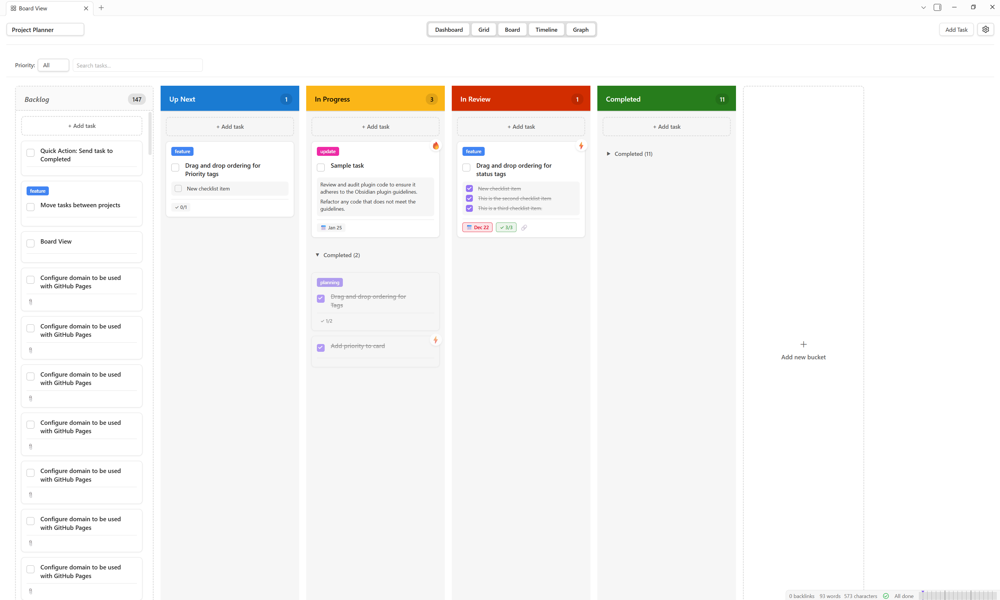
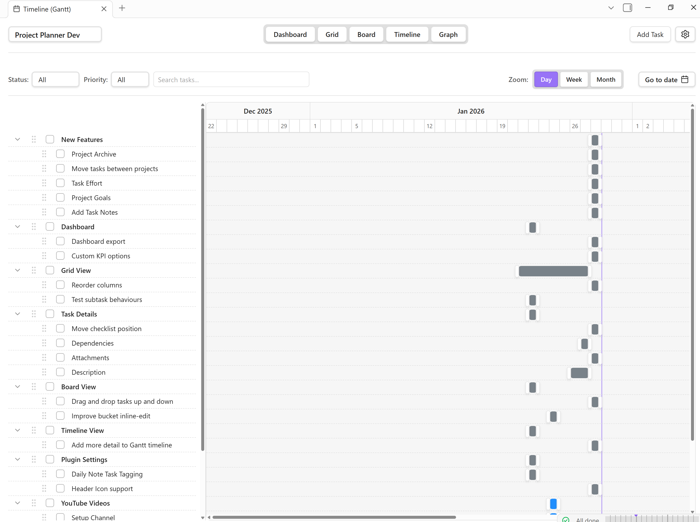

# Project Planner

Welcome to the ProjectPlanner.md, where you can find tips and guides on how to use and get the most out of your experience with Project Planner plugin for [Obsidian](https://obsidian.md).

## News & Updates

News, updates, tickets & tricks.

- :rocket: **2026-01-29** - [0.6.7 Development Release](blog/posts/0-6-7-dev.md)
- :material-arrow-right-circle-outline: **2026-01-25** - [0.6.6 Development Release](blog/posts/0-6-6-dev.md)
- :material-arrow-right-circle-outline: **2026-01-22** - [0.6.5 Development Release](blog/posts/0-6-5-dev.md)
- :simple-readme: **Stay Informded!** - [View Blog](https://projectplanner.md/blog/)

---

## Check out the Views

### Dashboard
The Dashboard view provides a high-level overview of all your projects and tasks, presenting key performance indicators (KPIs) and project summaries in an easy-to-digest visual format.

[:octicons-arrow-right-24: Learn more about Dashboard view](views/dashboard-view.md) 

### Grid view

The Grid view is the primary task management interface in Project Planner, providing a powerful hierarchical table for organizing and managing your tasks.

[:octicons-arrow-right-24: Learn more about Grid view](views/grid-view.md) 

### Board view

The Board view provides a Kanban board for visualizing and managing tasks across different stages. It offers an intuitive drag-and-drop interface with cards organized in custom buckets that are independent from task status.

[:octicons-arrow-right-24: Learn more about Board view](views/board-view.md) 

### Timeline view

The Timeline view (also known as Gantt view) provides a visual timeline representation of tasks with their start and due dates. It displays tasks chronologically across a horizontal timeline, allowing you to see task durations, overlaps, and schedule gaps at a glance.

[:octicons-arrow-right-24: Learn more about Timeline view](views/timeline-view.md) 

## Get Started

Get up and running with Project Planner.

1. [What is Project Planner](about/about.md)
2. [Download and Install Project Planner in Obsidian](getting-started/installation.md)
3. [Take your first steps](getting-started/first-steps.md)

## Getting help

Get support, ask a question or learn how to report bugs and security issues.

1. [Ask a question](https://github.com/ArctykDev/obsidian-project-planner/discussions)
2. [Share an idea](community/sharing-ideas.md)
3. [Report an bug or issue](https://github.com/ArctykDev/obsidian-project-planner/issues)
4. [Report a security issue](community/security.md)

## Contributing to Project Planner

Are you interested in contributing to Project Planner? Here are some ways you can help.

1. [Learn how to contribute](community/contributing.md)
2. [Donate to the project](community/contributing/#donations.)
3. [Join Discussion Forum](https://github.com/ArctykDev/obsidian-project-planner/discussions)

## Support the work

Project Planner is free to use and enjoy but if you have it in your heart to show some love, you're welcome to buy me a coffee. Donations are put right back into Project Planner. [Learn more about Donations](community/contributing.md#donations)

