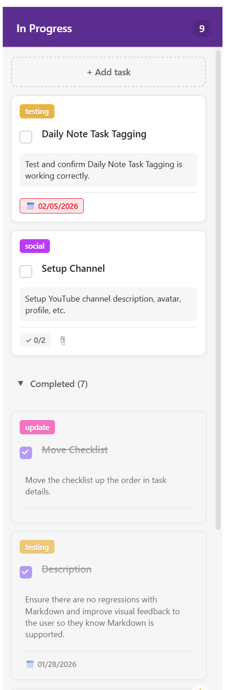
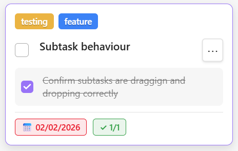

# Board View (Kanban)

## Overview

The Board View provides a Microsoft Planner-style Kanban board for visualizing and managing tasks across different stages. It offers an intuitive drag-and-drop interface with cards organized in custom buckets that are independent from task status.

## **What are buckets?**

In Obsidian Project Planner, columns are called **buckets**. Buckets represent a step in your workflow process, such as "To Do", "In Progress", "In Review", "Done". Buckets are flexible, meaning they can be renamed, added or removed, rearranged or coloured to suite your workflow.

### **Bucket features**

- Buckets are configured at the project-level. This means each project can have a different bucket configuration
- Drag and drop to easily reorder buckets
- Add, rename, and delete buckets (Right-click or open bucket menu)
- Default buckets: "To Do", "In Progress", "Done" are placeholders and can be customized
- The "Unassigned" bucket cannot be moved or coloured, but it can be renamed
- Each bucket shows task count (active + completed)
- Tasks are shown in task cards which can be added, edited, or removed from buckets

Each bucket has two sections:

- **Active Tasks**: Incomplete tasks (checkboxes, status tracking)
- **Completed Tasks**: Collapsible section for finished tasks
- Toggle completed section visibility per bucket

{ width="200" }

## **What are task cards?**

**Task cards** display information for each task in Board view. 

{ width="200" }

Each card shows:

- **Title** - Task name (clickable to open details)
- **Priority Indicators** - 🔥 Critical / ⚡ High priority badges
- **Tags** - Colored labels for categorization
- **Status** - Current task status with color coding
- **Due Date** - With overdue (red) and today (blue) highlighting
- **Subtask Progress** - Checklist completion (✓ 2/5)
- **Dependencies** - 🔗 indicator for linked tasks
- **Attachments** - 📎 indicator for links/files
- **Completion Checkbox** - Click to mark complete (moves to completed section)
- **Context Menu** - Right-click for delete option

## **How to Manage Tasks**

**Create Task:**

1. Click "Add Task" in header to create with default bucket
2. Click "+ Add task" at top of specific bucket
3. New tasks appear in active section of target bucket

**Move Task:**

1. Click and drag a task card
2. Hover over target bucket
3. Release to drop and update bucket assignment

**Complete Task:**

1. Click checkbox on task card
2. Task moves to completed section of same bucket
3. Click again to mark incomplete (returns to active section)

**Edit Task:**

- Click card title to open Task Details panel
- Edit all properties including bucket assignment
- Changes sync instantly to the card

**Delete Task:**

- Right-click card for context menu
- Select "Delete" option
- Confirm deletion

## How to Manage Buckets

Buckets are configured per project and independent from task status:

1. Click bucket header to select
2. Drag bucket headers left/right to reorder
3. Add new bucket: Click "+" button in toolbar
4. Rename bucket: Edit name inline in bucket header
5. Delete bucket: Select bucket, click delete (tasks remain, bucketId cleared)

### **What is the difference bewteen Bucket and Status?**

Important distinction:

- **Status**: Task lifecycle state (To Do, In Progress, Done, etc.) - shown on cards
- **Bucket**: Visual grouping for organization - determines column placement
- Tasks can have any status in any bucket
- Change status via task details panel or Grid View
- Change bucket via drag-and-drop or task details dropdown

### **Per-Project Buckets**

- Each project has its own bucket configuration
- Switching projects loads that project's buckets
- Default buckets created automatically for new projects
- Buckets saved in project settings

## Customization Tips

### **Organize Workflows**

Use buckets to match your workflow:

- **By Phase**: "Planning", "Development", "Testing", "Deployed"
- **By Team**: "Backend", "Frontend", "Design", "QA"
- **By Sprint**: "Backlog", "Sprint 1", "Sprint 2", "Done"
- **By Priority**: "Critical", "This Week", "Next Week", "Someday"

### **Combine Status and Buckets**

- Use status for lifecycle tracking (visible on cards)
- Use buckets for organizational grouping (column placement)
- Example: "Design" bucket can have tasks with "In Progress" or "Done" status

### **Use Completed Sections**

- Keep completed tasks in each bucket for context
- Collapse completed sections to reduce clutter
- Use filters to find specific completed items

### **Use Tags for Categories**

Add colored tags for:

- Feature areas (Frontend, Backend, Design)
- Priority levels (if not using built-in priorities)
- Team members or assignments

### **Set Due Dates**

- Red indicators show overdue items
- Blue highlights show tasks due today
- Great for time-sensitive work

### **Track Progress with Subtasks**

- Break tasks into checklist items
- Card shows completion percentage
- Green badge when all subtasks complete

## Tips & Best Practices

1. **Limit Bucket Count**: 3-7 buckets work best for visual clarity
2. **Use Completed Sections**: Keep context without clutter by collapsing completed
3. **Leverage Filters**: Use priority and search filters to focus on specific work
4. **Drag Efficiently**: Quickly triage and organize tasks by dragging between buckets
5. **Separate Status and Buckets**: Use status for lifecycle, buckets for organization
6. **Hide Parents**: Board shows leaf tasks only - manage hierarchies in Grid View
7. **Per-Project Layouts**: Each project can have unique bucket configurations

---

## Support

**Need Help?**

- Read the [FAQ](../getting-started/faq.md)
- Check [Home](../index.md) for plugin overview
- Report bugs on [GitHub Issues](https://github.com/ArctykDev/project-planner-docs/issues)
