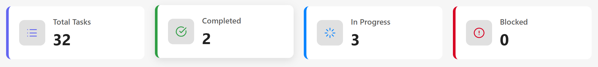
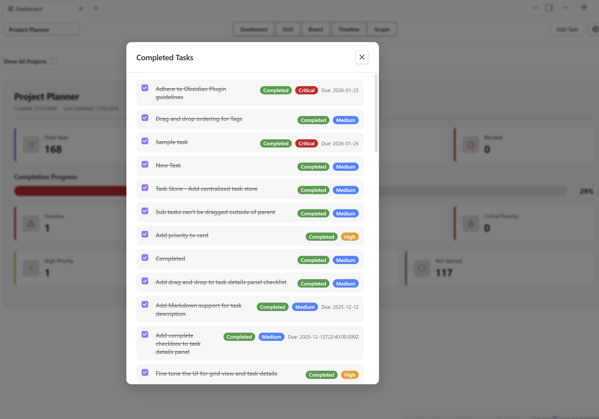
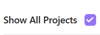

# Dashboard View

The Dashboard view provides a high-level overview of all your projects and tasks, presenting key performance indicators (KPIs) and project summaries in an easy-to-digest visual format.

## Overview

Dashboard View serves as your command center for project monitoring:

- **Project Cards** - Visual cards for each project with metadata
- **KPI Metrics** - Task completion rates and statistics
- **Show All Projects** - See all projects in one view
- **Real-Time Updates** - Metrics update as tasks change

## Project Cards

Each project card displays information about a specific data metric from the project, such as task status, priority, and due date. Project cards cannot be custom configured at this time but support for this is planned for a future release.

### Card Actions

Clicking on a project card will display a list of tasks for the related metric.

## View Multiple Projects

By default, the Dashboard will show the currently active project. To view all projects, check **Show All Tasks** in the Dashboard header. 

## Support

**Need Help?**

- Read the [FAQ](../getting-started/faq.md)
- Check [Home](../index.md) for plugin overview
- Report bugs on [GitHub Issues](https://github.com/ArctykDev/project-planner-docs/issues)

**Related Documentation:**

- [Grid View Guide](grid-view.md) - Detailed task management
- [Board View Guide](board-view.md) - Kanban workflows
- [Timeline View Guide](timeline-view.md) - Gantt charts
- [Dependency Graph Guide](dependency-graph-view.md) - Task relationships
