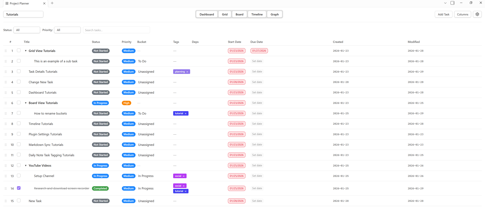

# Grid View Guide

The Grid View is the primary task management interface in Project Planner, providing a powerful hierarchical table for organizing and managing your tasks.



## Overview

Grid View presents your tasks in a spreadsheet-like interface with support for:

- **Hierarchical organization** - Create parent tasks with nested subtasks
- **Multiple columns** - View and edit all task properties at once
- **Inline editing** - Quick updates without opening detail panels
- **Filtering and sorting** - Focus on what matters
- **Drag-and-drop reordering** - Organize tasks your way

## Opening Grid View

**From Ribbon:**

- Click the calendar-check icon in the left sidebar

**From Command Palette:**

- Press `Ctrl/Cmd + P`
- Type "Open Project Planner"
- Press Enter

**From Settings:**

- Set as default view in Settings → Project Planner → Default View

## Interface Elements

### Header Bar

Located at the top of the grid view:

- **Project Selector** - Dropdown to switch between projects
- **View Buttons** - Quick access to Board, Timeline, Dashboard, and Graph views
- **Add Task Button** - Create new top-level tasks
- **Filter Indicators** - Shows active filters (status, priority, tags)

### Column Headers

Click column headers to:

- **Sort** - Ascending/descending order
- **Show/Hide** - Toggle column visibility via settings
- **Resize** - Drag column borders (where supported)

### Task Rows

Each row represents a task with:

- **Expand/Collapse Icon** - For tasks with children (►/▼)
- **Checkbox** - Mark tasks as complete
- **Editable Cells** - Click to edit values inline
- **Action Buttons** - Delete, add child, open details


## Creating Tasks

### New Top-Level Task

1. Click the **"+ Add Task"** button in the header
2. Enter task title
3. Press Enter or click outside to save

**Or:**

- Right-click in empty area
- Select "Add Task"

### New Subtask

**Method 1 - Inline:**

1. Hover over parent task
2. Click the **"Add Subtask"** icon (appears on hover)
3. Enter subtask title

**Method 2 - Drag and Drop:**

1. Create a new task
2. Drag it onto the parent task
3. It becomes a child automatically

**Method 3 - Task Details:**

1. Open task detail panel
2. Click "Make Subtask"
3. Select parent task

## Editing Tasks

### Inline Editing

**Quick Edit:**

- Click any cell to edit its value
- Make changes
- Click outside or press Enter to save
- Press Escape to cancel

**Supported Fields:**

- Title (text input)
- Status (dropdown)
- Priority (dropdown)
- Bucket (dropdown)
- Dates (date picker)
- Tags (multi-select)

### Detail Panel

For more complex edits:

1. Click task title or row
2. Detail panel opens on the right
3. Edit description, subtasks, links, dependencies
4. Changes save automatically

## Task Hierarchy

### Creating Parent-Child Relationships

**Drag and Drop:**

1. Select a task
2. Drag it onto another task
3. Release to make it a child

**Promote to Top-Level:**

1. Drag child task to the left
2. Drop when vertical line appears at left edge

### Expanding and Collapsing

**Collapse/Expand Single Task:**

- Click the ► or ▼ icon next to task title

**Collapse/Expand All:**

- Use keyboard shortcut (if configured)
- Or click each parent task individually

**Visual Indicators:**

- ► = Collapsed (children hidden)
- ▼ = Expanded (children visible)
- No icon = No children

### Working with Hierarchies

**Benefits:**

- **Organization**: Group related tasks
- **Planning**: Break large tasks into steps
- **Tracking**: See progress at parent level
- **Filtering**: Show/hide entire branches

**Best Practices:**

- Keep hierarchy depth reasonable (2-3 levels)
- Use parents for phases or milestones
- Use children for actionable work items
- Complete children before marking parent complete

## Filtering Tasks

### Filter Bar

Access filters via the header:

- **Status Filter**: Show only specific statuses
- **Priority Filter**: Filter by priority level
- **Tag Filter**: Show tasks with specific tags
- **Completed Toggle**: Show/hide completed tasks

### Active Filter Indicators

When filters are active:

- Labels appear in header showing active filters
- Example: "Status: In Progress" or "Tags: Frontend, Urgent"
- Click filter label to modify or clear

### Clearing Filters

- Click individual filter indicator to remove
- Or access filter menu and deselect all

## Sorting Tasks

### Column Sorting

Click any column header to sort:

- **First Click**: Sort ascending (A-Z, earliest first)
- **Second Click**: Sort descending (Z-A, latest first)
- **Third Click**: Remove sort

**Sortable Columns:**

- Title (alphabetical)
- Status (by configured order)
- Priority (by configured order)
- Dates (chronological)
- Bucket (alphabetical)

### Manual Ordering

**Drag and Drop:**

1. Click and hold task row
2. Drag to new position
3. Release to drop
4. Order is saved automatically

**Hierarchy Considerations:**

- Can reorder within same parent
- Can reorder top-level tasks
- Cannot mix levels during reorder

## Task Actions

### Checkbox (Complete)

- Click checkbox to mark complete
- Status automatically changes to "Completed"
- Task may be hidden if "Show Completed" is off
- Uncheck to mark incomplete

### Delete Task

**Method 1:**

1. Hover over task row
2. Click delete icon (trash can)
3. Confirm deletion

**Method 2:**

1. Right-click task
2. Select "Delete"
3. Confirm

**Deletion Behavior:**

- Deleting parent task promotes children to top-level
- No tasks are lost
- Action cannot be undone (currently)

### Duplicate Task

**Via Context Menu:**

1. Right-click task
2. Select "Copy"
3. Right-click where you want the new task go
4. Select "Paste"
5. New task created

## Keyboard Shortcuts

### Navigation

- **Tab**: Move to next cell
- **Shift + Tab**: Move to previous cell
- **Arrow Keys**: Navigate between cells (when not editing)
- **Enter**: Edit selected cell / Save edit
- **Escape**: Cancel edit

### Task Management

- **Delete**: Delete selected task (with confirmation)
- **Ctrl/Cmd + N**: New task (if configured)
- **Ctrl/Cmd + Enter**: Mark task complete (if configured)

_Note: Some shortcuts may require configuration in settings_


## Integration with Other Views

### Board View

- **Bucket Column**: Determines board column placement
- **Status Independent**: Bucket ≠ Status
- **Sync**: Changes in grid reflect in board and vice versa

### Timeline (Gantt) View

- **Date Driven**: Start/due dates determine timeline position
- **Dependencies**: Show task relationships
- **Visual Planning**: See grid tasks on calendar timeline

### Dashboard

- **Metrics**: Task counts aggregate from grid
- **KPIs**: Completion rates calculated from grid data
- **Projects**: Click project card to open in grid view

### Task Detail Panel

- **Right Sidebar**: Opens when clicking task
- **Extended Edit**: Edit description, subtasks, links
- **Dependencies**: Visual dependency editor
- **Links**: Attach Obsidian notes or external URLs

## Markdown Sync

When "Enable Markdown Sync" is active:

### Auto-Creation

Tasks in grid automatically create markdown files:

- Location: `{ProjectName}/Tasks/{TaskTitle}.md`
- Format: YAML frontmatter + markdown body
- Updates: Changes sync bidirectionally

### Manual Sync

- Click "Sync All Tasks Now" in settings
- All grid tasks generate/update markdown files
- Useful for bulk operations or initial sync

### Sync Behavior

- **Grid → Markdown**: Updates on task change
- **Markdown → Grid**: Updates when file saved
- **Conflict**: Last write wins
- **New Tasks**: Can create in either location

See [Markdown Sync](../features/markdown-sync.md) for details.

## Daily Note Integration

When "Enable Daily Note Sync" is active:

### Tagged Tasks

Tasks tagged in daily notes appear in grid:

- `#planner` → Default project
- `#planner/ProjectName` → Specific project
- Real-time import as you type
- Updates sync back to daily notes

### Metadata Extraction

Grid tasks from daily notes include:

- Priority from `!!!`, `!!`, `!` indicators
- Due dates from `📅 YYYY-MM-DD` format
- Additional tags from hashtags
- Source link back to daily note

See [Daily Notes Tagging](../features/daily-notes-tagging.md) for details.

## Tips and Best Practices

### Organization

**Use Hierarchy Wisely:**

- Top-level = Projects or phases
- Children = Deliverables or milestones
- Grandchildren = Individual tasks
- Avoid going deeper than 3 levels

**Status Workflow:**

1. Not Started → New tasks
2. In Progress → Active work
3. Blocked → Waiting on dependencies
4. Completed → Finished tasks

**Bucket Assignment:**

- Use buckets for workflow stages
- Different from status (can be in-progress in any bucket)
- Helpful for board view visualization

### Efficiency Tips

**Keyboard First:**

- Learn Tab navigation for quick edits
- Use Enter to edit, Escape to cancel
- Minimize mouse usage for faster input

**Batch Updates:**

- Sort by status to update many at once
- Filter to focus on specific subset
- Use detail panel for complex edits

**Regular Maintenance:**

- Archive completed tasks periodically
- Review blocked tasks weekly
- Update due dates proactively

### Performance

**Large Projects:**

- Use filters to reduce visible tasks
- Collapse unused task trees
- Consider splitting into multiple projects

**Sync Considerations:**

- Markdown sync adds overhead
- Disable if not using markdown files
- Use manual sync for bulk operations

## Troubleshooting

### Tasks Not Appearing

1. **Check Active Project**: Verify correct project selected
2. **Check Filters**: Clear status/priority/tag filters
3. **Show Completed**: Enable if looking for finished tasks
4. **Refresh**: Close and reopen view

### Hierarchy Issues

**Children Not Showing:**

- Click expand icon (►) on parent
- Check if "Show Completed" is off and children are done

**Can't Create Subtask:**

- Ensure parent task is saved first
- Try reopening grid view
- Check for plugin errors in console

### Editing Problems

**Can't Edit Cell:**

- Click directly on cell content
- Wait for edit mode to activate
- Check if task is syncing from markdown

**Changes Not Saving:**

- Press Enter or click outside to save
- Check Developer Console for errors
- Verify data.json has write permissions

### Performance Issues

**Grid Loading Slowly:**

- Reduce number of visible tasks
- Disable markdown sync temporarily
- Check for very large task hierarchies

**Lag When Editing:**

- Close task detail panel if open
- Reduce number of tags/filters
- Consider splitting project

## Advanced Features

### URI Linking

Open specific tasks via URI:

```
obsidian://open-planner-task?id=task-id&project=project-id
```

Use for:

- External integrations
- Quick navigation from other notes
- Bookmark frequently accessed tasks

### Console Debugging

Enable Developer Console (Ctrl+Shift+I):

- Look for `[Project Planner]` messages
- Check for errors during task operations
- Verify sync operations with `[TaskSync]` logs

### Data Structure

For detailed information about how tasks and projects are stored, see the [Data Structure Reference](../features/data-structure.md).


---

## Support 

**Need Help?**

- Read the [FAQ](../getting-started/faq.md)
- Check [Home](../index.md) for plugin overview
- Report bugs on [GitHub Issues](https://github.com/ArctykDev/project-planner-docs/issues)

**Related Documentation:**

- [Task Details View](task-details-view.md) - Individual task management
- [Board View Guide](board-view.md) - Kanban workflows
- [Timeline View Guide](timeline-view.md) - Gantt charts
- [Dependency Graph Guide](dependency-graph-view.md) - Task relationships
