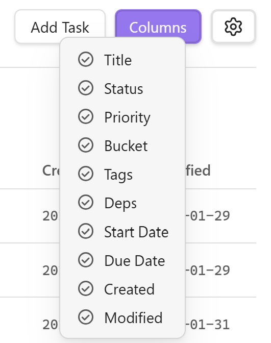
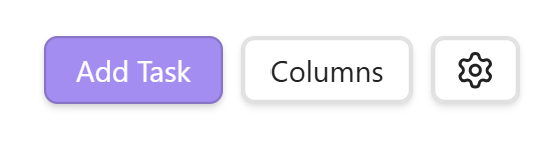
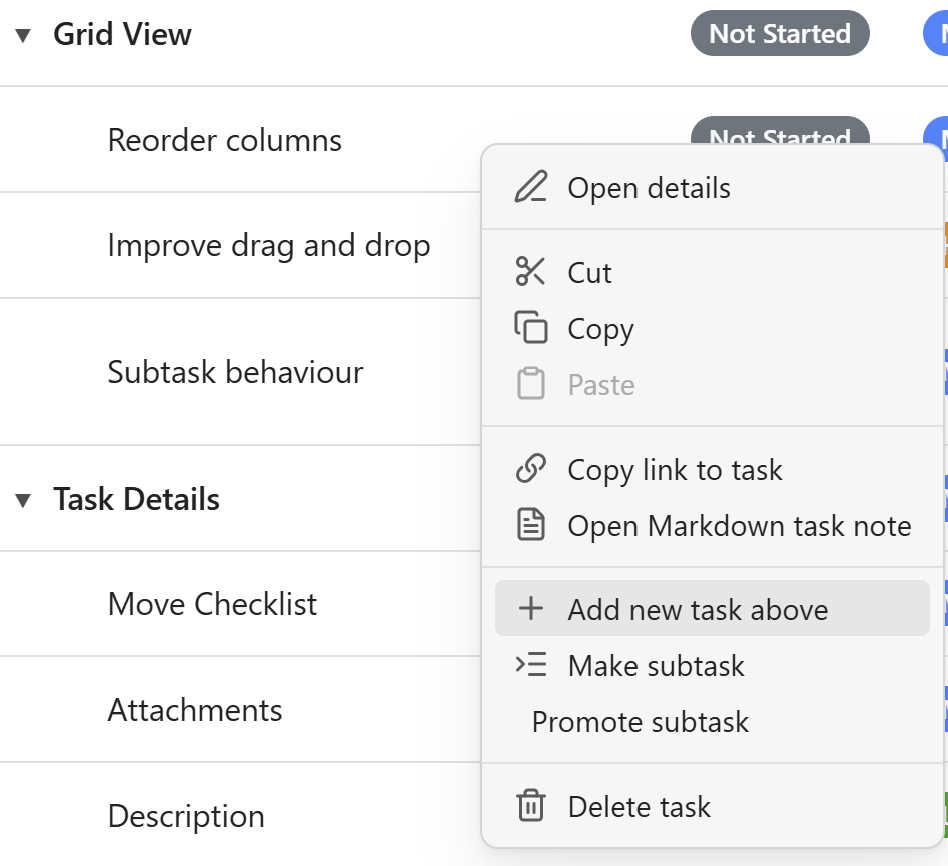
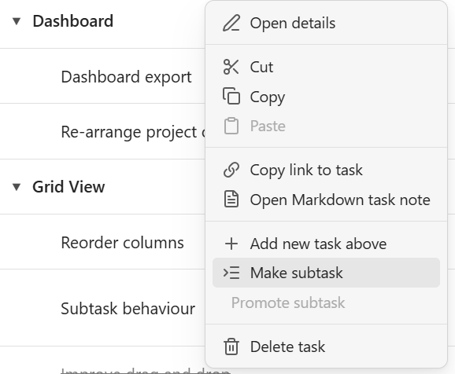
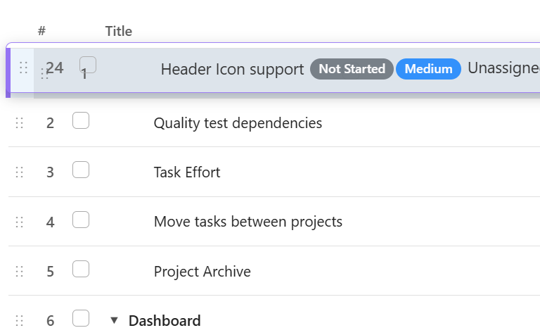
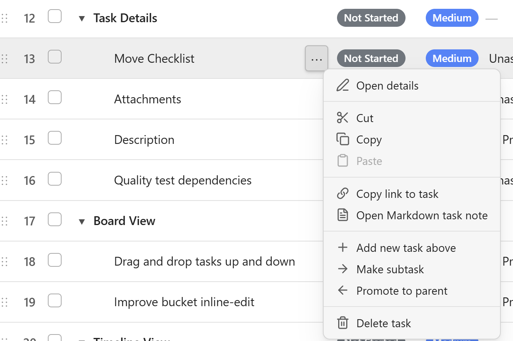

# Grid View Guide

The Grid View is the primary task management interface in Project Planner, providing a powerful hierarchical table for organizing and managing your tasks.

## Overview

Grid View presents your tasks in a spreadsheet-like interface with support for:

- **Hierarchical organization** - Create parent tasks with nested subtasks
- **Multiple columns** - View and edit all task properties at once
- **Inline editing** - Quick updates without opening detail panels
- **Filtering and sorting** - Focus on what matters
- **Drag-and-drop reordering** - Organize tasks your way

## How to navigate the Grid view

### Using the top header bar

Located at the top of the grid view:

{ width="400" .center}

- **Project Selector** - Dropdown to switch between projects
- **View Buttons** - Quick access to Board, Timeline, Dashboard, and Graph views
- **Add Task Button** - Create new top-level tasks
- **Filter Indicators** - Shows active filters (status, priority, tags)

### How to customize columns

- Click the column headers to sort acending/decending order (▲/▼)
- Hover over the column header edge to adjust the width of the column (↔)
- Hover/click on the colum header to drag the column 

To show or hide columns, click on the "Columns" button:

    

### Task Rows

Each row represents a task with:

- **Expand/Collapse Icon** - For tasks with children (►/▼)
- **Checkbox** - Mark tasks as complete
- **Editable Cells** - Click to edit values inline
- **Action Buttons** - Delete, add child, open details

## How to create a task

### To add a new Top-Level task

1. Click the **"+ Add Task"** button in the header

    { width="200" .center}

2. Enter task title
3. Press Enter or click outside to save

**Or:**

- Right-click anywhere the task row, or click on the "..." button
- Select "Add new task above"

    { width="300" .center}

### How to add a new subtask

**Method 1 - Inline:**

1. Hover over a task
2. Click the **"..."** icon (appears on hover)
3. Select "Make subtask" from the context menu

{ width="300" .center}

**Method 2 - Drag and Drop:**

1. Create a new task
2. Drag it onto the parent task
3. It becomes a child automatically

{ width="350" .center}

## How do I edit tasks?

You can edit tasks in-line or through the Task Details panel. 

### To edit in-line:

- Click any cell to edit its value

    { width="300" .center}

- Make changes
- Click outside or press Enter to save
- Press Escape to cancel

### To edit using the Task Details panel

The Task Details panel provides a way to update all task options in one view.

1. Right-click task row or click the task menu button
2. Select "Open details"

    { width="350" .center}

3. Detail panel opens on the right
4. Edit description, subtasks, links, dependencies
5. Changes save automatically

## How are tasks stored?

For detailed information about how tasks and projects are stored, see the [Data Structure Reference](../features/data-structure.md).

---

## Support 

**Need Help?**

- Read the [FAQ](../getting-started/faq.md)
- Check [Home](../index.md) for plugin overview
- Report bugs on [GitHub Issues](https://github.com/ArctykDev/project-planner-docs/issues)
